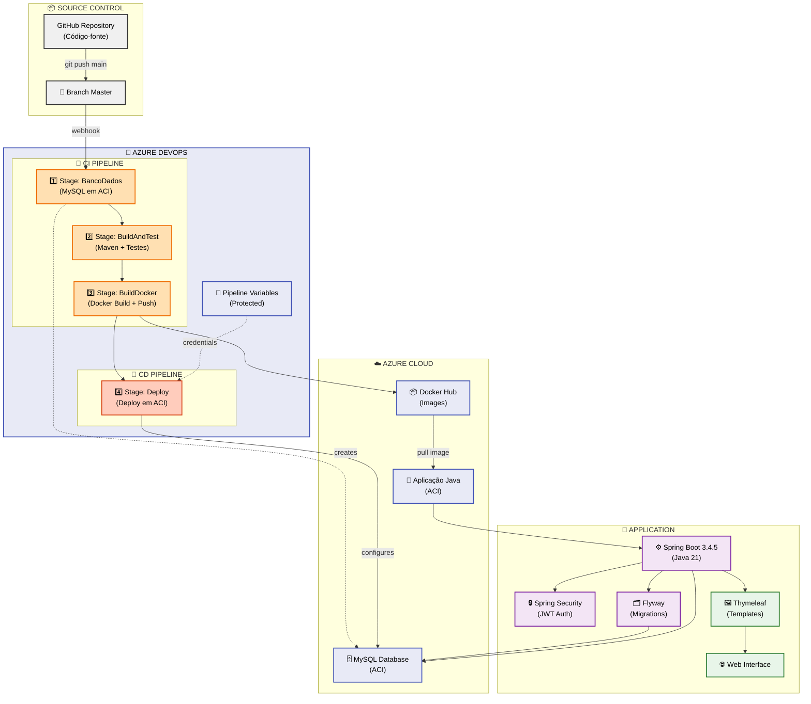

# MottuFlow - Sistema de Gerenciamento de Frotas
<div align="center">

  

  <br><br>

  
  
  
  
  
  

  <br><br>

  [](https://youtu.be/ZSeNwQoHll4)
  [](https://dev.azure.com/RM554874/Sprint4%E2%80%93AzureDevOps-MottuFlowDevops)

</div>

## 🚀 Visão Geral

**MottuFlow** é uma aplicação híbrida desenvolvida em Java para gerenciamento inteligente de frotas de motocicletas. O sistema oferece uma solução completa com interface web administrativa e API REST robusta, deployada na nuvem Microsoft Azure com **pipeline CI/CD totalmente automatizada**.

### Características Principais

- **🔧 API REST Completa** - Integração para aplicações mobile e front-ends
- **🌐 Interface Web Administrativa** - Dashboard com Thymeleaf
- **🔐 Autenticação JWT** - Segurança robusta para APIs
- **☁️ Cloud-Ready** - Deploy automatizado no Azure
- **🐳 Containerizado** - Aplicação totalmente dockerizada
- **⚙️ CI/CD Automático** - Pipeline de integração e deploy contínuo

## ✨ Funcionalidades

O sistema oferece gerenciamento completo de:

- 👥 **Funcionários** - Cadastro e gerenciamento de colaboradores
- 🏢 **Pátios** - Controle de localidades e estacionamentos
- 🏍️ **Motos** - Gestão completa da frota de motocicletas
- 📹 **Câmeras** - Sistema de monitoramento integrado
- 🏷️ **ArUco Tags** - Tags de identificação para rastreamento
- 📊 **Status das Motos** - Monitoramento em tempo real
- 📍 **Localidades** - Gestão geográfica das operações

## 🏗️ Arquitetura



## 🛠️ Tecnologias

### Backend
- **Java 21** - Linguagem principal
- **Spring Boot 3.4.5** - Framework de aplicação
- **Spring Security** - Segurança e autenticação
- **JWT** - Tokens de autenticação
- **Flyway** - Migração de banco de dados

### Frontend
- **Thymeleaf** - Template engine para interface web

### Banco de Dados
- **MySQL 8.0** - Banco de dados relacional

### Infraestrutura
- **Docker** - Containerização
- **Microsoft Azure** - Cloud provider
  - Azure Container Instances (ACI)
  - Azure DevOps - Pipeline CI/CD

---

# 🚀 Pipeline CI/CD

A aplicação utiliza **Azure DevOps** para automação completa de Integração Contínua (CI) e Deployment Contínuo (CD).

## 📋 Como Funciona

A pipeline executa **automaticamente** sempre que você faz `git push` na branch `main`:

```
┌─────────────────────────┐
│   Você faz PUSH         │
│   git push origin main  │
└────────┬────────────────┘
         │
         ▼
╔══════════════════════════════════════════════════╗
║         STAGE 1: BancoDados (CI)                 ║
║  ✅ Cria Container MySQL em Azure                ║
║  ✅ Aguarda estar 100% pronto                    ║
║  ✅ Obtém IP para próximas stages                ║
╚────────┬─────────────────────────────────────────╝
         │
         ▼
╔══════════════════════════════════════════════════╗
║      STAGE 2: BuildAndTest (CI)                  ║
║  ✅ Instala Java 21                              ║
║  ✅ Executa: mvn clean package                   ║
║  ✅ Executa TESTES AUTOMÁTICOS com BD real       ║
║  ✅ Publica JAR no Azure DevOps                  ║
╚────────┬─────────────────────────────────────────╝
         │
         ▼
╔════════════════════════════════════════════╗
║     STAGE 3: BuildDocker (CI)              ║
║  ✅ Build da imagem Docker (Dockerfile)    ║
║  ✅ Login no Docker Hub                    ║
║  ✅ Push da imagem para Docker Hub         ║
║     → seu_usuario/mottuflow-app:123        ║
╚────────┬───────────────────────────────────╝
         │
         ▼
╔════════════════════════════════════════╗
║      STAGE 4: Deploy (CD)              ║
║  ✅ Remove container anterior          ║
║  ✅ Cria novo Container em ACI         ║
║  ✅ Configura variáveis de ambiente    ║
║  ✅ Aplicação fica disponível          ║
╚════════════════════════════════════════╝
         │
         ▼
    ✅ SUCESSO!
    Aplicação está rodando em produção!
```

## 🔄 Detalhamento de Cada Stage

### Stage 1: BancoDados 🗄️

**O que faz:**
- Provisiona um container MySQL em Azure Container Instance (ACI)
- Aguarda o banco estar 100% pronto para aceitar conexões
- Obtém o IP público do banco de dados
- Disponibiliza esse IP para as próximas stages

**Tempo:** ~2-3 minutos

### Stage 2: Build e Tests 🏗️

**O que faz:**
- Instala Java 21 na máquina de build
- Obtém o IP do MySQL da stage anterior
- Executa `mvn clean package` que:
  - Compila o código-fonte
  - Executa testes automáticos (conectando ao MySQL real!)
  - Gera arquivo JAR
- Publica o JAR no Azure DevOps (artefato)

**Testes:** Usa os testes padrão do Spring Boot com banco real

**Tempo:** ~2-3 minutos

### Stage 3: BuildDocker 🐳

**O que faz:**
- Faz build da imagem Docker usando seu Dockerfile multistage
- Faz login no Docker Hub com credenciais protegidas
- Envia (push) a imagem para Docker Hub com tags:
  - `seu_usuario/mottuflow-app:12345` (build ID)
  - `seu_usuario/mottuflow-app:latest` (mais recente)

**Dockerfile:** Localizado em [`MottuFlow/Dockerfile`](https://github.com/thejaobiell/MottuFlowDevops/blob/main/MottuFlow/Dockerfile)

**Resultado:** Imagem disponível em Docker Hub

**Tempo:** ~1-2 minutos

### Stage 4: Deploy 🚀

**O que faz:**
- Remove container anterior ( se existir )
- Cria novo container em Azure Container Instance com:
  - Imagem do Docker Hub
  - Variáveis de ambiente
  - Porta 8080 exposta
- Torna aplicação acessível via HTTP

**Resultado:** Aplicação rodando em: [`http://mottuflow-app.brazilsouth.azurecontainer.io:8080`](http://mottuflow-app.brazilsouth.azurecontainer.io:8080)

**Tempo:** ~1-2 minutos

## ⏱️ Tempo Total da Pipeline

**~6-10 minutos** do push até a aplicação estar em produção

## 🔐 Variáveis Protegidas

As credenciais são armazenadas no **Azure DevOps Secret Group** chamado `mottuflow-secrets`:

```
DOCKERHUB_USER          # Seu usuário Docker Hub
DOCKERHUB_PASSWORD      # Sua senha Docker Hub
DB_USER                 # Usuário do banco de dados
DB_PASSWORD             # Senha do banco de dados
DB_NAME                 # Nome do banco (mottuflow)
```

## 📂 Estrutura do Projeto

```
mottuflowdevops/
├── 📄 MottuFlow-links.pdf  # PDF com links para vídeo e repositório
├── 📄 azure-pipelines.yml  # Pipeline CI/CD
├── 📄 README.md            # Este arquivo aqui
├── 📄 ARQUITETURA.md       # Detalhes da Arquitetura do projeto
└── mottuflow/
    ├── 📄 Dockerfile                 # Configuração do container
    ├── 📄 docker-compose.yml         # Ambiente local
    ├── 📁 jsonsAPIREST/              # Coleção Postman
    ├── 🧹 limpar.sh                  # Script de limpeza
    └── 📁 src/
        ├── 📁 main/
        │   ├── 📁 java/              # Código fonte Java
        │   └── 📁 resources/
        │       ├── 📁 db/migration/  # Scripts Flyway
        │       ├── 📁 templates/     # Templates Thymeleaf
        │       └── 📁 static/        # Assets estáticos
        └── 📁 test/                  # Testes unitários
  ```

## 💾 Banco de Dados

### Gerenciamento de Migrações

O projeto utiliza o **MySQL** como banco de dados e o **Flyway** para versionamento automático dos dados:

- **Localização**: `src/main/resources/db/migration/`
- **Formato**: `V1__create_tables.sql`, `V2__insert_data.sql`, etc.
- **Execução**: Automática no deploy da aplicação

### Script Consolidado

Existe também um arquivo consolidado em `src/main/resources/db/script_bd.sql` contendo todas as estruturas e dados iniciais.

⚠️ **Nota**: Este arquivo não é executado pelo Flyway automaticamente.

## 🔧 Instalação e Deploy

### Pré-requisitos

Certifique-se de ter instalado:

- **Azure CLI** (v2.0+)
- **Docker** (v20.0+)
- **Git**
- **Bash**

### Setup Inicial - Azure DevOps

1. **Criar projeto no Azure DevOps:**
   - Nome: `Sprint 4 – Azure DevOps`
   - Visibility: Private
   - Version control: Git
   - Work item process: Scrum

2. **Conectar repositório GitHub:**
   - Vá em Pipelines → New Pipeline
   - Selecione GitHub
   - Autorizando acesso ao repositório

3. **Criar Secret Group (`mottuflow-secrets`):**
   - Vá em Pipelines → Library → Variable groups
   - Crie novo grupo: `mottuflow-secrets`
   - Adicione variáveis:
     ```
     DOCKERHUB_USER = seu_usuario ( por padrão está as credencias de João Gabriel )
     DOCKERHUB_PASSWORD = sua_senha ( por padrão está as credencias de João Gabriel )
     DB_USER = rm554874
     DB_PASSWORD = Mottuflow4874#
     DB_NAME = mottuflow
     ```

4. **Criar Service Connection Docker Hub:**
   - Vá em Project Settings → Service connections
   - New: Docker Registry
   - Nome: `dockerhubConnection`
   - Docker ID: seu_usuario_dockerhub ( por padrão está as credencias de João Gabriel )
   - Docker Password: sua_senha ( por padrão está as credencias de João Gabriel )

5. **Adicionar arquivo de pipeline:**
   - Coloque `azure-pipelines.yml` na raiz do repositório
   - Faça commit: `git add azure-pipelines.yml && git commit -m "Add CI/CD pipeline"`

## Instruções de atualização da aplicação

A pipeline executa **automaticamente** a cada push na branch `main`:

```bash
# 1. Clone do repositório
git clone https://github.com/thejaobiell/MottuFlowDevops
cd MottuFlowDevops

# 2. Faça suas alterações
echo "seu código aqui" >> arquivo.txt

# 3. Commit e Push
git add .
git commit -m "Sua mensagem"
git push origin main

# 4. Pipeline dispara automaticamente!
# Acompanhe em: Azure DevOps → Pipelines → [sua pipeline]
```

## 💻 Como Usar

### Interface Web (Thymeleaf)

1. **Acesse** a URL fornecida após o deploy
2. **Credenciais de acesso**:
   ```
   📧 Email: admin@email.com
   🔑 Senha: adminmottu
   ```
3. **Funcionalidades disponíveis**:
   - Dashboard administrativo
   - Gestão de funcionários
   - Controle de pátios e motos
   - Monitoramento em tempo real

## 🔌 API REST

### Configuração no Postman

1. **Importe** a coleção da pasta `jsonsAPIREST/`
2. **Configure** a URL base substituindo localhost pelo FQDN
3. **Obtenha** o token JWT de autenticação

### Autenticação

```http
POST /api/login
Content-Type: application/json

{
  "email": "admin@email.com",
  "senha": "adminmottu"
}
```

### Configuração do Bearer Token no Postman

1 - Clique em `API - MottuFlow`

2 - Vá para `Variables`

3 - Mude o valor da varíavel **JWT** para o seu token JWT

### Exemplos de Uso

```bash
# Obter token JWT
curl -X POST http://mottuflow-app.brazilsouth.azurecontainer.io:8080/api/login \
  -H "Content-Type: application/json" \
  -d '{"email":"admin@email.com","senha":"adminmottu"}'

# Listar funcionários (com token)
curl -X GET http://mottuflow-app.brazilsouth.azurecontainer.io:8080/api/funcionario/listar \
  -H "Authorization: Bearer [tokenAcesso]"
```

## 📊 Monitoramento da Pipeline

### Acompanhar Execução

1. Vá em **Azure DevOps → Pipelines**
2. Clique em sua pipeline
3. Acompanhe em tempo real:
   - Status de cada stage
   - Logs detalhados
   - Tempo de execução

### Se a Pipeline Falhar

1. Clique no stage que falhou
2. Verifique a seção "Logs"
3. Erros comuns:
   - ❌ **Java 21 não encontrado** → Verifique compatibilidade do agente
   - ❌ **Docker Hub credentials inválidos** → Revise secret group
   - ❌ **Testes falhando** → Verifique conectividade com MySQL
   - ❌ **Deploy não encontra imagem** → Confirme push para Docker Hub


## 🧹 Limpeza de Recursos

⚠️ **Importante**: Sempre execute para evitar custos desnecessários:

```bash
./limpar.sh
```

**Remove:**
- Todos os containers (MySQL e aplicação)
- Resource Groups
- Todos os recursos associados

## 👥 Equipe

<div align="center">

<table>
<tr>
<td align="center">
<a href="https://github.com/thejaobiell">
<br>
<sub><b>João Gabriel Boaventura</b></sub><br>
<sub>RM554874 • 2TDSB2025</sub><br>
</a>
</td>
<td align="center">
<a href="https://github.com/leomotalima">
<br>
<sub><b>Leo Mota Lima</b></sub><br>
<sub>RM557851 • 2TDSB2025</sub><br>
</a>
</td>
<td align="center">
<a href="https://github.com/LucasLDC">
<br>
<sub><b>Lucas Leal das Chagas</b></sub><br>
<sub>RM551124 • 2TDSB2025</sub><br>
</a>
</td>
</tr>
</table>

</div>
