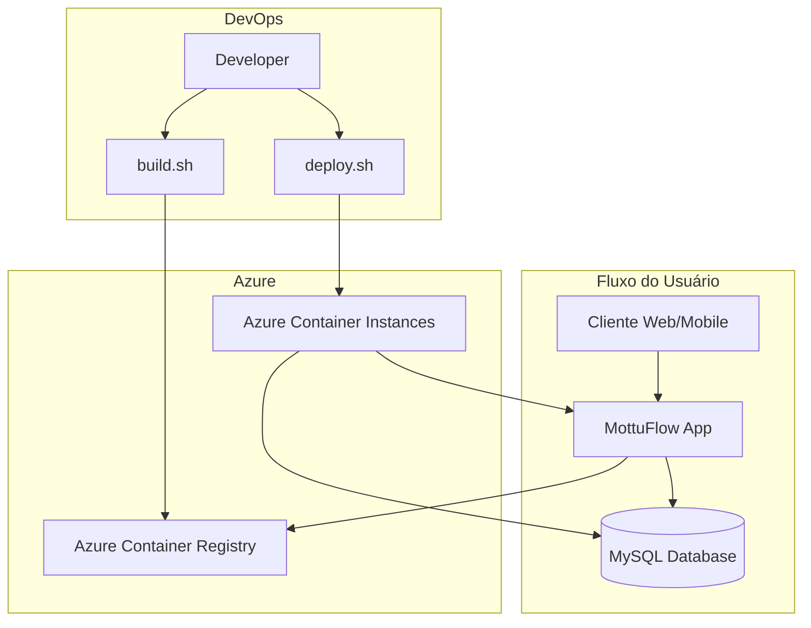

<div align="center">
  
  <h1>𝙈𝙤𝙩𝙩𝙪𝙁𝙡𝙤𝙬</h1>
</div>

<div align="center">
  
  
  
  
  
</div>

---

## 🚀 Sobre o Projeto

**MottuFlow** é uma aplicação híbrida completa desenvolvida em Java para gerenciamento inteligente de frotas de motocicletas. O sistema oferece funcionalidades avançadas para controle de:

- 👥 **Funcionários** - Cadastro e gerenciamento de colaboradores
- 🏢 **Pátios** - Controle de localidades e estacionamentos
- 🏍️ **Motos** - Gestão completa da frota de motocicletas
- 📹 **Câmeras** - Sistema de monitoramento integrado
- 🏷️ **ArUco Tags** - Tags de identificação para rastreamento
- 📊 **Status das Motos** - Monitoramento em tempo real
- 📍 **Localidades** - Gestão geográfica das operações

### ✨ Principais Características

- **🔧 API REST** - Integração completa para aplicações mobile e front-ends externos
- **🌐 Interface Web** - Dashboard administrativo com Thymeleaf
- **🔐 Autenticação JWT** - Segurança robusta para APIs
- **☁️ Cloud-Ready** - Deploy automatizado no Microsoft Azure
- **🐳 Containerizado** - Aplicação totalmente dockerizada

---

# Demonstração da Aplicação

[](https://www.youtube.com/watch?v=bszJ3kT55PI)

---

## 🏗️ Arquitetura



**Stack Tecnológica:**
- **Backend:** Java 21, Spring Boot, Spring Security
- **Frontend:** Thymeleaf
- **Database:** MySQL 8.0
- **Containerização:** Docker
- **Cloud:** Microsoft Azure (ACI + ACR)
- **Autenticação:** JWT (JSON Web Tokens)

---

## 📂 Estrutura do Repositório

```
mottuflow/
├── 📄 Dockerfile                 # Configuração do container da aplicação
├── 📄 docker-compose.yml         # Ambiente de desenvolvimento local
├── 📁 jsonsAPIREST/              # Coleção do Postman para testes
├── 🔧 build.sh                   # Script de build e push da imagem
├── 🚀 deploy.sh                  # Script de deploy no Azure
├── 🧹 limpar.sh                  # Script de limpeza dos recursos
└── 📁 src/                       # Código fonte da aplicação
    ├── 📁 main/
    │   ├── 📁 java/
    │   └── 📁 resources/
    └── 📁 test/
```

---

## Banco de Dados

O projeto utiliza **Flyway** para versionamento e migração do banco.  
As migrations estão em `src/main/resources/db/migration/` (arquivos `V1__...sql`, `V2__...sql`, etc).  
Esses arquivos são executados automaticamente pelo Flyway no deploy da aplicação.

Além disso, existe um arquivo `src/main/resources/db/script_bd.sql` que contém **todas as tabelas e inserts consolidados**.  
⚠️ Esse arquivo **não é executado pelo Flyway**.

---

## 🛠️ Pré-requisitos

Antes de começar, certifique-se de ter instalado:

- **Azure CLI** (v2.0 ou superior)
- **Docker** (v20.0 ou superior)
- **Git** (para clonagem do repositório)
- **Bash** (para execução dos scripts)

### Configuração Inicial

1. **Login no Azure:**
   ```bash
   az login
   ```

2. **Clone do repositório:**
   ```bash
   git clone https://github.com/fiap-2tds-dtcc-fev25/2tdsb-cp4-cp4-joaogabriel-lucasleal
   cd MottuFlowDevops/MottuFlow
   ```

3. **Permissões de execução:**
   ```bash
   chmod +x *.sh
   ```

---

### Deploy Passo a Passo

1. **Build e Push da Imagem**
   ```bash
   ./build.sh
   ```
   Este script irá:
   - ✅ Criar Resource Group no Azure
   - ✅ Provisionar Azure Container Registry
   - ✅ Fazer build da imagem Docker
   - ✅ Push da imagem para o ACR

2. **Deploy da Aplicação**
   ```bash
   ./deploy.sh
   ```
   Este script irá:
   - ✅ Criar container MySQL no ACI
   - ✅ Deploy da aplicação Java no ACI
   - ✅ Configurar networking e DNS
   - ✅ Expor aplicação publicamente

3. **Verificação do Deploy**
   
   Após o deploy, o script exibirá:
   ```
   🚀 App acessível em: http://aci-app-cp4-rm554874-dns.brazilsouth.azurecontainer.io:8080
   ```

---

## ⚙️ Scripts de Automação

### 🔨 build.sh
**Função:** Prepara e publica a imagem Docker

```bash
#!/bin/bash
# Funcionalidades:
# - Criação do Resource Group
# - Configuração do Azure Container Registry
# - Build da imagem Docker
# - Push para ACR com tag latest
```

**Saída esperada:**
```
✅ Resource Group criado
✅ ACR configurado e acessível
✅ Imagem buildada com sucesso
✅ Push para ACR concluído
```

### 🚀 deploy.sh
**Função:** Provisiona infraestrutura e faz deploy

```bash
#!/bin/bash
# Funcionalidades:
# - Deploy do MySQL com persistência
# - Deploy da aplicação Java
# - Configuração de rede e DNS
# - Validação de saúde dos containers
```

**Saída esperada:**
```
✅ Container MySQL criado
✅ Container da aplicação criado
✅ DNS configurado
🌐 App acessível em: http://aci-app-cp4-rm554874-dns.brazilsouth.azurecontainer.io:8080
```

### 🧹 limpar.sh
**Função:** Remove todos os recursos do Azure

```bash
#!/bin/bash
# Funcionalidades:
# - Remoção do Resource Group completo
# - Limpeza de todos os recursos associados
# - Prevenção de custos desnecessários
```

---

## 💻 Como Usar

### 🌐 Interface Web (Thymeleaf)

1. **Acesse a aplicação** através do FQDN fornecido após o deploy
2. **Faça login** com as credenciais administrativas:
   
   ```
   📧 Email: admin@email.com
   🔑 Senha: adminmottu
   ```

3. **Navegue** pelas funcionalidades disponíveis:
   - Dashboard principal
   - Gestão de funcionários
   - Controle de pátios e motos

### 📱 Desenvolvimento Local

Para testes locais:

1. Crie um arquivo `.env` e coloque isso dentro:
```bash
  DB_ROOT_PASSWORD=root
  DB_HOST=db
  DB_PORT=3306
  DB_NAME=mottuflow
  DB_USER=usuario
  DB_PASSWORD=usuario123
  SERVER_PORT=8080
```

2. No terminal rode este comando:
```bash
# Subir ambiente local
docker-compose up -d
```

3. Acessar aplicação
[http://localhost:8080](http://localhost:8080)


4. Após a utilização rode este comando
```bash
docker-compose down
```

---

## 🔌 API REST

### Configuração no Postman

1. **Importe a coleção** da pasta `jsonsAPIREST/`
2. **Substitua** o localhost pelo *FQDN*
3. **Configure a autenticação JWT:**

   ```http
   POST /api/login
   Content-Type: application/json

   {
     "email": "admin@email.com",
     "senha": "adminmottu"
   }
   ```

4. **Configure o Bearer Token** no environment do Postman:
   - Enviroment: `variavel de ambiente JWT`
   - Variável: `auth.bearerToken`
   - Valor: `<tokenAcesso>`

### Exemplo de Uso

```bash
# Obter token JWT
curl -X POST http://aci-app-cp4-rm554874-dns.brazilsouth.azurecontainer.io:8080/api/login \
  -H "Content-Type: application/json" \
  -d '{"email":"admin@email.com","senha":"adminmottu"}'
  ```


```bash
# Listar funcionários (com token)
curl -X GET http://aci-app-cp4-rm554874-dns.brazilsouth.azurecontainer.io:8080/api/funcionario/listar \
  -H "Authorization: Bearer [tokenAcesso]"
```
---

## 🧹 Limpeza de Recursos

```bash
# Após validação, sempre execute:
./limpar.sh
```

---

## 👥 Equipe

<div align="center">

| Nome | RM | Turma |
|------|----|-------|
| **João Gabriel Boaventura Marques e Silva** | 554874 | 2TDSB-2025
| **Lucas Leal das Chagas** | 551124 | 2TDSB-2025
| **Leo Mota Lima** | 557851 | 2TDSB-2025

</div>
