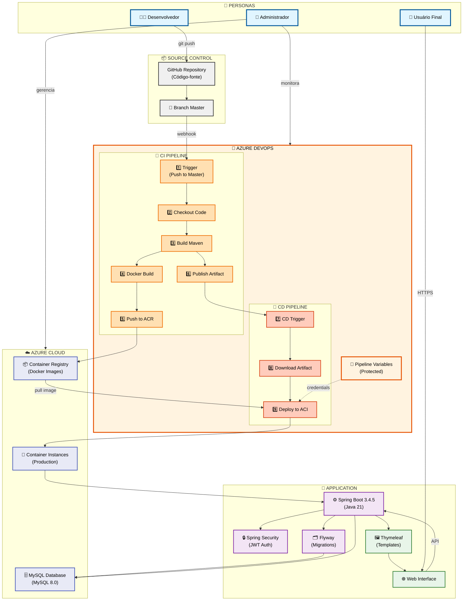

# MottuFlow - Sistema de Gerenciamento de Frotas
<div align="center">

  

  <br><br>

  
  
  
  
  

  <br><br>

  [](https://www.youtube.com/watch?v=IvxQle04Qqw)

</div>

## 🚀 Visão Geral

**MottuFlow** é uma aplicação híbrida desenvolvida em Java para gerenciamento inteligente de frotas de motocicletas. O sistema oferece uma solução completa com interface web administrativa e API REST robusta, deployada na nuvem Microsoft Azure.

### Características Principais

- **🔧 API REST Completa** - Integração para aplicações mobile e front-ends
- **🌐 Interface Web Administrativa** - Dashboard com Thymeleaf
- **🔐 Autenticação JWT** - Segurança robusta para APIs
- **☁️ Cloud-Ready** - Deploy automatizado no Azure
- **🐳 Containerizado** - Aplicação totalmente dockerizada

## ✨ Funcionalidades

O sistema oferece gerenciamento completo de:

- 👥 **Funcionários** - Cadastro e gerenciamento de colaboradores
- 🏢 **Pátios** - Controle de localidades e estacionamentos
- 🏍️ **Motos** - Gestão completa da frota de motocicletas
- 📹 **Câmeras** - Sistema de monitoramento integrado
- 🏷️ **ArUco Tags** - Tags de identificação para rastreamento
- 📊 **Status das Motos** - Monitoramento em tempo real
- 📍 **Localidades** - Gestão geográfica das operações

## 🏗️ Arquitetura



## 🛠️ Tecnologias

### Backend
- **Java 21** - Linguagem principal
- **Spring Boot** - Framework de aplicação
- **Spring Security** - Segurança e autenticação
- **JWT** - Tokens de autenticação
- **Flyway** - Migração de banco de dados

### Frontend
- **Thymeleaf** - Template engine para interface web

### Banco de Dados
- **MySQL 8.0** - Banco de dados relacional

### Infraestrutura
- **Docker** - Containerização
- **Microsoft Azure** - Cloud provider
  - Azure Container Instances (ACI)
  - Azure Container Registry (ACR)

## 📂 Estrutura do Projeto

```
mottuflow/
├── 📄 Dockerfile                 # Configuração do container
├── 📄 docker-compose.yml         # Ambiente local
├── 📁 jsonsAPIREST/              # Coleção Postman
├── 🔧 build.sh                   # Script de build
├── 🚀 deploy.sh                  # Script de deploy
├── 🧹 limpar.sh                  # Script de limpeza
└── 📁 src/
    ├── 📁 main/
    │   ├── 📁 java/              # Código fonte Java
    │   └── 📁 resources/
    │       ├── 📁 db/migration/  # Scripts Flyway
    │       └── 📁 static/        # Assets estáticos
    └── 📁 test/                  # Testes unitários
```

## 💾 Banco de Dados

### Gerenciamento de Migrações

O projeto utiliza **Flyway** para versionamento automático do banco de dados:

- **Localização**: `src/main/resources/db/migration/`
- **Formato**: `V1__create_tables.sql`, `V2__insert_data.sql`, etc.
- **Execução**: Automática no deploy da aplicação

### Script Consolidado

Existe também um arquivo consolidado em `src/main/resources/db/script_bd.sql` contendo todas as estruturas e dados iniciais. 

⚠️ **Nota**: Este arquivo não é executado pelo Flyway automaticamente.

## 🔧 Instalação e Deploy

### Pré-requisitos

Certifique-se de ter instalado:

- **Azure CLI** (v2.0+)
- **Docker** (v20.0+)
- **Git** 
- **Bash**

### 1. Configuração Inicial

```bash
# Login no Azure
az login

# Clone do repositório
git clone https://github.com/thejaobiell/MottuFlowDevops
cd MottuFlowDevops/MottuFlow

# Permissões de execução
chmod +x *.sh
```

### 2. Build e Deploy

#### Passo 1: Build da Imagem

```bash
./build.sh
```

**O script irá:**
- ✅ Criar Resource Group no Azure
- ✅ Provisionar Azure Container Registry
- ✅ Fazer build da imagem Docker
- ✅ Push da imagem para o ACR

#### Passo 2: Deploy da Aplicação

```bash
./deploy.sh
```

**O script irá:**
- ✅ Criar container MySQL no ACI
- ✅ Deploy da aplicação Java no ACI
- ✅ Configurar networking e DNS
- ✅ Expor aplicação publicamente

### 3. Verificação

Após o deploy bem-sucedido, você receberá a URL de acesso:

```
🚀 App acessível em: http://mottuflow-app-dns-554874.brazilsouth.azurecontainer.io:8080/api
```

## 💻 Como Usar

### Interface Web (Thymeleaf)

1. **Acesse** a URL fornecida após o deploy
2. **Credenciais de acesso**:
   ```
   📧 Email: admin@email.com
   🔑 Senha: adminmottu
   ```
3. **Funcionalidades disponíveis**:
   - Dashboard administrativo
   - Gestão de funcionários
   - Controle de pátios e motos
   - Monitoramento em tempo real

## 🔌 API REST

### Configuração no Postman

1. **Importe** a coleção da pasta `jsonsAPIREST/`
2. **Configure** a URL base substituindo localhost pelo FQDN
3. **Obtenha** o token JWT de autenticação

### Autenticação

```http
POST /api/login
Content-Type: application/json

{
  "email": "admin@email.com",
  "senha": "adminmottu"
}
```

### Configuração do Bearer Token

No Postman:
- **Environment**: `variavel de ambiente JWT`
- **Variável**: `auth.bearerToken`
- **Valor**: `<tokenAcesso>`

### Exemplos de Uso

```bash
# Obter token JWT
curl -X POST http://mottuflow-app-dns-554874.brazilsouth.azurecontainer.io:8080/api/login \
  -H "Content-Type: application/json" \
  -d '{"email":"admin@email.com","senha":"adminmottu"}'

# Listar funcionários (com token)
curl -X GET http://mottuflow-app-dns-554874.brazilsouth.azurecontainer.io:8080/api/funcionario/listar \
  -H "Authorization: Bearer [tokenAcesso]"
```

## 🔧 Scripts de Automação

### build.sh
**Função**: Prepara e publica a imagem Docker

**Funcionalidades**:
- Criação do Resource Group
- Configuração do Azure Container Registry
- Build da imagem Docker
- Push para ACR com tag latest

**Saída esperada**:
```
✅ Resource Group criado
✅ ACR configurado e acessível
✅ Imagem buildada com sucesso
✅ Push para ACR concluído
```

### deploy.sh
**Função**: Provisiona infraestrutura e faz deploy

**Funcionalidades**:
- Deploy do MySQL com persistência
- Deploy da aplicação Java
- Configuração de rede e DNS
- Validação de saúde dos containers

**Saída esperada**:
```
✅ Container MySQL criado
✅ Container da aplicação criado
✅ DNS configurado
🚀 App acessível em: http://mottuflow-app-dns-554874.brazilsouth.azurecontainer.io:8080/api
```

### limpar.sh
**Função**: Remove todos os recursos do Azure

**Funcionalidades**:
- Remoção completa do Resource Group
- Limpeza de todos os recursos associados
- Prevenção de custos desnecessários

## 🧹 Limpeza de Recursos

⚠️ **Importante**: Sempre execute após validação para evitar custos desnecessários:

```bash
./limpar.sh
```

## 👥 Equipe

<div align="center">

| Nome | RM | Turma |
|------|----|----|
| **João Gabriel Boaventura Marques e Silva** | 554874 | 2TDSB-2025 |
| **Lucas Leal das Chagas** | 551124 | 2TDSB-2025 |
| **Leo Mota Lima** | 557851 | 2TDSB-2025 |

</div>

